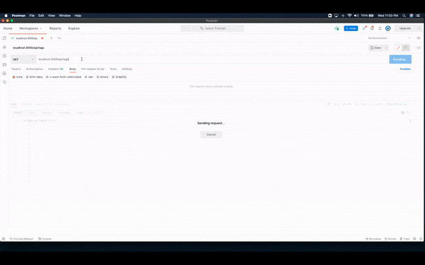

  # eCommerce
  

## Description
🔍 The back end for an e-commerce site by modifying starter code. Configuration of a working Express.js /api to allow sequelize to interact with a MySql data base.
## Table of Contents
- [Description](#description)
- [Installation](#installation)
- [Tests](#tests)

## Installation
💾 
1. Clone Repository 
2. npm i 
3. npm run  seed --to seed data 
4. nodemon/ node server.js/ npm start
## Tests
✏️  Viewing Tags, Categories and Products as well as creating a new category and then deleting new category by id

## Questions
✋ 
Alexander Noriega
email: alexnoriega47@gmail.com 

    